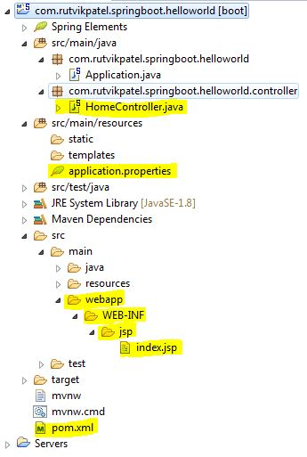
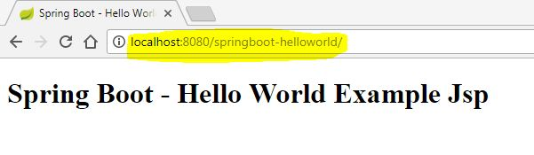

# springboot-hello-world-jsp
Day 5 - Spring Boot - Hello World Example with JSP


> In this tutorial you will know how to create Hello World Example with JSP in Spring Boot in simplest way.


### Project Structure




### Let’s Setup Environment

1. Maven 3 and any latest version
2. JDK 1.6 / JDK 1.7 / JDK 1.8 / JDK 1.9
3. Eclipse Kepler / Eclipse Juno / Eclipse Neon


### 1. Got to http://start.spring.io and select dependencies Web for your project.


### 2. Extract that project and import in eclipse.

> File > Import > Existing Maven Projects > Click ``Next`` > Select project root directory > Click ``Finish``


### 3. Add Extra dependencies in ``pom.xml`` file

```XML
<dependencies>
	<dependency>
		<groupId>org.springframework.boot</groupId>
		<artifactId>spring-boot-starter-web</artifactId>
	</dependency>
	<dependency>
		<groupId>org.springframework.boot</groupId>
		<artifactId>spring-boot-starter-test</artifactId>
		<scope>test</scope>
	</dependency>
	
	<!-- JSTL for JSP -->
	<dependency>
		<groupId>javax.servlet</groupId>
		<artifactId>jstl</artifactId>
	</dependency>
	
	<!-- Need this to compile JSP -->
	<dependency>
		<groupId>org.apache.tomcat.embed</groupId>
		<artifactId>tomcat-embed-jasper</artifactId>
		<scope>provided</scope>
	</dependency>
</dependencies>
```


### 4. Add project configuration properties in ``src/main/resources/application.properties`` file

```
# jsp view binding configuration 
spring.mvc.view.prefix=/WEB-INF/jsp/
spring.mvc.view.suffix=.jsp

# project context and port configuration
server.port=8080
server.context-path=/springboot-helloworld
```


### 5. Add Controller Class in ``src/main/java/package/HomeController.java`` file

```JAVA
import org.springframework.stereotype.Controller;
import org.springframework.ui.Model;
import org.springframework.web.bind.annotation.RequestMapping;
import org.springframework.web.bind.annotation.RequestMethod;

@Controller
public class HomeController {

	@RequestMapping(value = "/", method = RequestMethod.GET )
	public String hello(Model model){
		model.addAttribute("title", "Spring Boot - Hello World Example Jsp");
		return "index";
	}
	
}
```


### 6. Add JSP view in ``webapp/WEB-INF/jsp/index.jsp`` file

```JSP
<%@ page language="java" contentType="text/html; charset=ISO-8859-1" pageEncoding="ISO-8859-1"%>
<%@ taglib prefix="spring" uri="http://www.springframework.org/tags"%>
<%@ taglib prefix="c" uri="http://java.sun.com/jsp/jstl/core"%>

<!DOCTYPE html>
<html>
<head>
<title>${title}</title>
</head>
<body>
	<h1>${title}</h1>
</body>
</html>
```




# That's It...you are ready to Run


> Right click to project > Run As > Spring Boot App

go to http://localhost:8080/springboot-helloworld/


## Meta

Rutvik Patel - rrpatel003@gmail.com

Distributed under the GPL V3.0 license. See ``LICENSE`` for more information.
